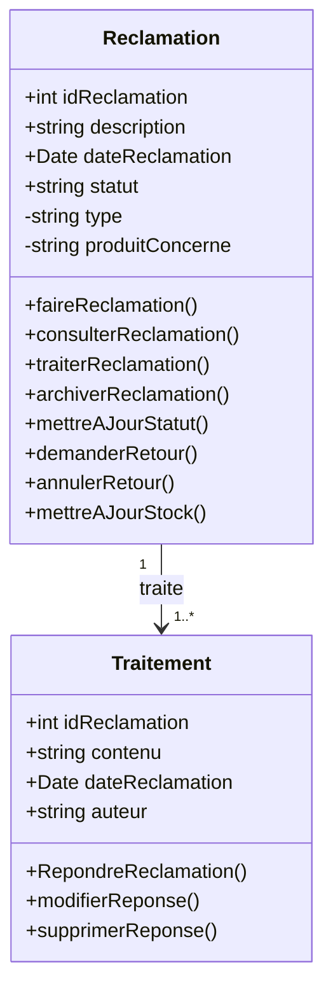
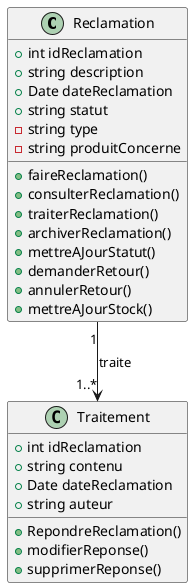

# Diagramme de Classes - Système de Réclamations

## Diagramme UML des Entités

## Description des Classes

### Classe Reclamation

**Attributs publics :**
- `idReclamation` (int) : Identifiant unique de la réclamation
- `description` (string) : Description détaillée de la réclamation
- `dateReclamation` (Date) : Date de création de la réclamation
- `statut` (string) : Statut actuel (En attente, En traitement, Résolue, Fermée)

**Attributs privés :**
- `type` (string) : Type de réclamation (Réclamation produit, Retour produit, etc.)
- `produitConcerne` (string) : Nom du produit concerné

**Méthodes :**
- `+faireReclamation()` : Créer une nouvelle réclamation
- `+consulterReclamation()` : Consulter les détails d'une réclamation
- `+traiterReclamation()` : Démarrer le traitement d'une réclamation
- `+archiverReclamation()` : Archiver une réclamation
- `+mettreAJourStatut()` : Mettre à jour le statut de la réclamation
- `+demanderRetour()` : Demander un retour de produit
- `+annulerRetour()` : Annuler une demande de retour
- `+mettreAJourStock()` : Mettre à jour le stock après un retour/résolution

### Classe Traitement

**Attributs publics :**
- `idReclamation` (int) : Identifiant de la réclamation traitée (clé étrangère)
- `contenu` (string) : Contenu de la réponse/traitement
- `dateReclamation` (Date) : Date du traitement
- `auteur` (string) : Auteur du traitement (admin/support)

**Méthodes :**
- `+RepondreReclamation()` : Répondre à une réclamation
- `+modifierReponse()` : Modifier une réponse existante
- `+supprimerReponse()` : Supprimer une réponse

## Relation entre les Classes

**Reclamation → Traitement :**
- **Cardinalité** : 1 → 1..*
- **Signification** : Une réclamation peut avoir un ou plusieurs traitements
- **Type** : Association unidirectionnelle
- **Description** : Chaque réclamation peut recevoir plusieurs réponses/traitements de la part de l'équipe support

## Diagramme Textuel (Format PlantUML)

## Correspondance avec l'Implémentation

### Modèle Reclamation (models/Reclamation.php)
Les attributs du modèle correspondent au diagramme :
- `idReclamation` ✓
- `description` ✓
- `dateReclamation` ✓
- `statut` ✓
- `type` ✓ (privé dans le diagramme)
- `produitConcerne` ✓ (privé dans le diagramme)

### Modèle Traitement (models/Traitement.php)
Les attributs du modèle correspondent au diagramme :
- `idReclamation` ✓
- `contenu` ✓
- `dateReclamation` ✓
- `auteur` ✓

### Contrôleurs
Les méthodes du diagramme sont implémentées dans les contrôleurs :
- **ReclamationController** : Gère les opérations CRUD sur les réclamations
- **TraitementController** : Gère les opérations CRUD sur les traitements

## Notes d'Implémentation

1. **Méthodes métier** : Les méthodes comme `faireReclamation()`, `traiterReclamation()`, etc. sont implémentées via les contrôleurs plutôt que directement dans les modèles (pattern MVC).

2. **Relations** : La relation 1→1..* est gérée via la clé étrangère `idReclamation` dans la table `traitement`.

3. **Visibilité** : 
   - Les attributs `type` et `produitConcerne` sont privés dans le diagramme mais accessibles via des getters/setters dans l'implémentation.

4. **Méthodes supplémentaires** : Le diagramme inclut des méthodes métier qui peuvent être implémentées dans les contrôleurs ou comme méthodes utilitaires.
